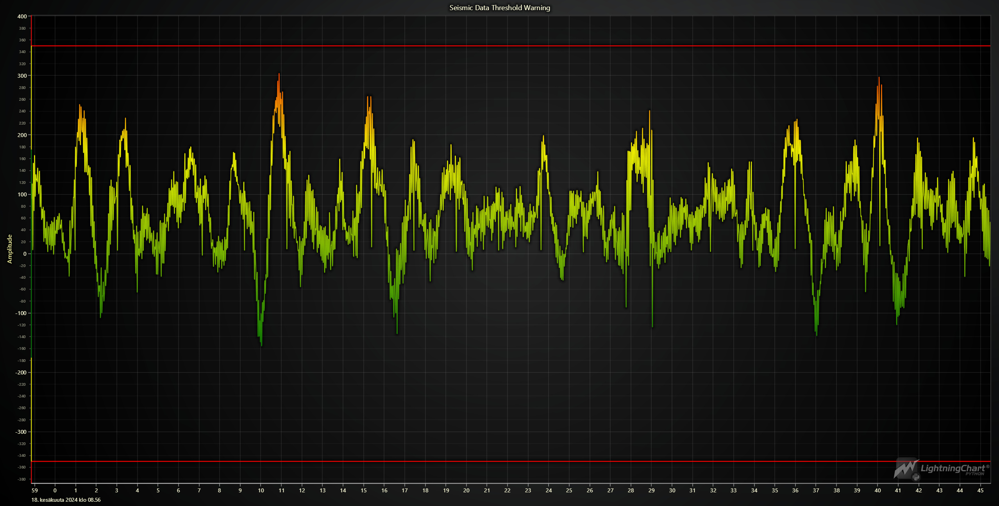

# Real-time Python Seismic Hazard Mapping Application

## Introduction

Seismic hazard mapping applications, pivotal in monitoring and assessing earthquake risks, provide real-time data visualization and analysis for informed decision-making by scientists, engineers, and policymakers. In the era of technological advancement, Python has emerged as a potent tool for developing these applications. This article delves into the development of a real-time Python seismic hazard mapping application, showcasing the use of LightningChart Python and other essential libraries.

## What is a Seismic Hazard Mapping Application?

A seismic hazard mapping application, a software tool designed to collect, process, and visualize real-time seismic data, has practical applications in monitoring seismic waveforms and their amplitude variations over time. The application, as demonstrated in this project, connects to a real-time seismic data stream, processes the incoming data to filter out high-frequency noise, and then dynamically visualizes the waveform data using high-performance charting tools. This practical application allows users to observe and analyze seismic activity as it occurs, aiding in the identification of potential seismic events based on the amplitude of the waves. By visualizing these real-time waveform data, the application plays a crucial role in assessing seismic hazards and can be integrated into a broader early warning or monitoring system.

## Importance of Seismic Hazard Mapping Applications

Seismic hazard mapping applications are vital for several reasons:

1. **Risk Assessment:** They help assess a region's seismic risks, which is crucial for urban planning and construction.
2. **Early Warning Systems:** By providing real-time data, these applications can be integrated into early warning systems to alert communities before an earthquake strikes.
3. **Research and Analysis:** They enable researchers to analyze seismic patterns and improve our understanding of earthquake mechanics.

## Overview of LightningChart Python

LightningChart is a high-performance charting library designed to visualize large datasets in real-time. It offers a wide range of chart types and features, making it an excellent choice for developing a Python seismic hazard mapping application.

### Features and Chart Types

LightningChart Python provides various features that enhance data visualization:

- **High Performance:** Can render millions of data points with minimal latency.
- **Customization:** Offers extensive customization options for axes, series, and chart appearance.
- **Real-time Data Updates:** Supports dynamic updates to visualizations, making it ideal for real-time monitoring.

### Performance Characteristics

LightningChart Python is optimized for performance, ensuring smooth and responsive visualizations even with large datasets. This makes it suitable for real-time seismic monitoring applications, where timely data representation is critical.

## Setting Up Python Environment

### Installing Python and Necessary Libraries

To develop a Python seismic hazard mapping application, you need to install Python and several essential libraries. Here's a quick setup guide:

1. **Install Python:** Download and install the latest version of Python from the [official website](https://www.python.org/).
2. **Install Libraries:** Use `pip` to install the required libraries:
   ```sh
   pip install obspy lightningchart
   ```

### Overview of Libraries Used

- **ObsPy:** A Python framework for processing seismological data. ([documentation](https://docs.obspy.org/))
- **LightningChart Python:** A high-performance charting library for visualizing data in real-time. ([documentation](https://lightningchart.com/python-charts/docs/))

### Setting Up Your Development Environment

Set up your development environment by creating a new Python project and installing the necessary libraries. For a smooth experience, use an Integrated Development Environment (IDE) like PyCharm or VSCode.

## Acquiring and Processing Earthquake Data

### Data Sources and Data Explanation

Seismic data can be acquired from various sources, such as the [IRIS Seismic Data Center](https://www.iris.edu/hq/). This data typically includes information about seismic events' time, location, and magnitude.

### Data Cleaning and Preparation

The data needs to be cleaned and processed before visualization. This involves filtering noise, normalizing values, and preparing the data for visualization.

#### Lowpass Filtering

Lowpass filtering is an essential step in the data-cleaning process for seismic data. This technique helps remove high-frequency noise from the data, which can obscure the significant seismic signals. Here's a detailed explanation of how lowpass filtering is applied in our Python seismic hazard mapping application:

1. **Nyquist Frequency Calculation:** The Nyquist frequency is half of the seismic data's sampling rate. It represents the highest frequency that the data can accurately describe.

   ```python
   nyquist_freq = trace.stats.sampling_rate / 2
   ```
2. **Setting the Cutoff Frequency:** The cutoff frequency determines which frequencies will be filtered out. In this case, we set the cutoff at 40% of the Nyquist frequency to remove high-frequency noise while preserving the essential seismic signals.

   ```python
   cutoff_freq = nyquist_freq * 0.4
   ```
3. **Applying the Lowpass Filter:** The lowpass filter is applied to the seismic data using the ObsPy library's `filter` function. The filter parameters include the cutoff frequency, the number of corners (which affects the sharpness of the filter), and the `zerophase` parameter to avoid phase distortion.

   ```python
   trace.filter('lowpass', freq=cutoff_freq, corners=4, zerophase=True)
   ```

Applying this lowpass filter ensures the data is clean and ready for accurate visualization and analysis. This process effectively reduces the amplitude range of the data, which helps highlight significant seismic events.

## Visualizing Earthquake Data with LightningChart Python

### Overview of the Chart Types to be Used

Our application will use the `ChartXY` type from LightningChart Python to create a dynamic line chart that visualizes seismic data in real time.

### Building the Real-time Application

Here's a step-by-step guide to building the application:

1. **Initialize the Chart:**

   ```python
   import lightningchart as lc

   lc.set_license("LICENSE_KEY")
   chart = lc.ChartXY(title='Seismic Data Threshold Warning', theme=lc.Themes.Dark).open(live=True)
   ```
2. **Configure the Axes:**

   ```python
   x_axis = chart.add_x_axis(axis_type='linear-highPrecision')
   x_axis.set_tick_strategy('DateTime').set_scroll_strategy('progressive')
   x_axis.set_interval(start=0, end=10000, stop_axis_after=False)
   y_axis = chart.get_default_y_axis()
   y_axis.set_title("Amplitude")
   ```
3. **Add a Line Series:**

   ```python
   series = chart.add_line_series(data_pattern='ProgressiveX').set_line_thickness(2)
   ```
4. **Customize the Series:**
   The line series is customized to change color based on the amplitude values to enhance the visualization. This helps in quickly identifying significant variations in seismic activity:

   ```python
   series.set_line_color_lookup_table(
       steps=[
           {'value': 350, 'color': lc.Color('red')},
           {'value': 175, 'color': lc.Color('yellow')},
           {'value': -175, 'color': lc.Color('green')},
           {'value': -350, 'color': lc.Color('yellow')},
           {'value': -400, 'color': lc.Color('red')}
       ],
       look_up_property='y',
       interpolate=True,
       percentage_values=False
   )
   ```
5. **Adding Constant Lines:**
   Constant lines are added to the chart to highlight specific threshold values for amplitude. These lines are static and provide a visual reference for when the amplitude exceeds certain critical levels:

   ```python
   constant_line = y_axis.add_constant_line().set_interaction_move_by_dragging(False)
   constant_line.set_value(350)
   constant_line.set_stroke(2.5, lc.Color(255, 0, 0))

   constant_line2 = y_axis.add_constant_line().set_interaction_move_by_dragging(False)
   constant_line2.set_value(-350)
   constant_line2.set_stroke(2.5, lc.Color(255, 0, 0))
   ```

   The red constant lines at values 350 and -350 indicate critical amplitude thresholds, providing an easy way to monitor when seismic activity exceeds these levels.
6. **Create a Client for Real-time Data:**

   ```python
   from obspy.core import Stream
   from obspy.clients.seedlink.easyseedlink import EasySeedLinkClient
   import time

   # Custom EasySeedLinkClient for receiving and processing seismic data
   class MyClient(EasySeedLinkClient):
       def __init__(self, *args, **kwargs):
           super().__init__(*args, **kwargs)
           self.series = series    # Reference to the chart series
           self.data = []  # List to hold the data
           self.stream = Stream()  # ObsPy stream to store trace data

       # Append data to the chart
       def append_to_chart(self):
           if self.data:
               x, y = self.data.pop(0)
               self.series.add(x, y)
               time.sleep(0.01)    # Sleep to control the data update rate

       # Callback method when data is received
       def on_data(self, trace):
           print('Received trace:')
           print(trace)

           # Calculate the Nyquist frequency and set the lowpass filter cut-off
           nyquist_freq = trace.stats.sampling_rate / 2
           cutoff_freq = nyquist_freq * 0.4  # Setting cut-off at 40% of Nyquist frequency

           # Apply lowpass filter with the calculated cut-off frequency
           trace.filter('lowpass', freq=cutoff_freq, corners=4, zerophase=True)

           # Add the filtered trace to the stream
           self.stream += trace

           # Convert trace times to milliseconds for x-values
           x_values_seconds = trace.times().tolist()
           start_time = trace.stats.starttime.timestamp * 1000
           x_values = [start_time + sec * 1000 for sec in x_values_seconds]
           y_values = trace.data.tolist()

           # Append the x- and y-values to the data list
           for x, y in zip(x_values, y_values):
               self.data.append((x, y))
               self.append_to_chart()  # Update the chart with new data

   # Initialize the client with the Seedlink server address
   client = MyClient('rtserve.iris.washington.edu:18000')
   # Select the stream to receive data from
   client.select_stream('WI', 'BIM', 'HHZ')
   # Start the client to begin receiving data
   client.run()
   ```

### Data Integration and Customization

Integrate real-time seismic data into the application and customize the visualization by adjusting the chart properties, adding annotations, or setting threshold lines to highlight significant events.

### Deployment or Running the Application

Deploy the application on a local server or a cloud platform to enable real-time monitoring. Ensure the environment is appropriately configured and the necessary libraries and dependencies are installed.

## The End Result



## Conclusion

In this article, we have explored the development of a real-time Python seismic hazard mapping application using LightningChart Python. By leveraging the power of Python and high-performance charting tools, we can create dynamic and responsive visualizations for seismic data. This application enhances our ability to monitor and analyze seismic activity and contributes to the broader goal of mitigating earthquake risks. The benefits of using LightningChart Python for visualizing data are manifold, including high performance, customization options, and real-time data updates, making it an ideal choice for seismic hazard mapping applications.
